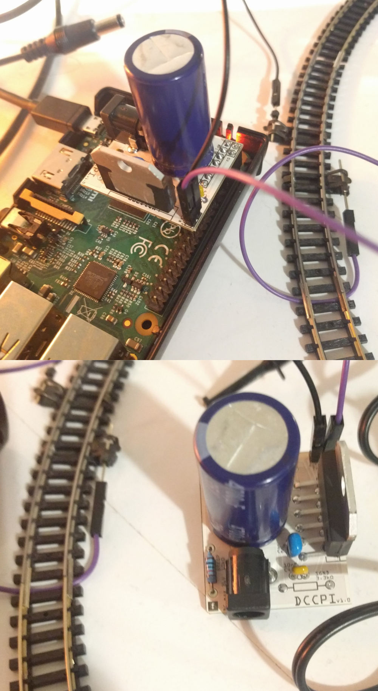

go-dcc
======

[](http://godoc.org/github.com/hsanjuan/go-dcc)
[](https://travis-ci.org/hsanjuan/go-dcc)
[](https://coveralls.io/github/hsanjuan/go-dcc?branch=master)


> NRMA Digital Command Control (DCC) implementation in Go.

This module implements the DCC protocol for controlling model trains.

It includes a Raspberry Pi driver and a `dccpi` command line application for easy use on this platform, although it is
easily extensible to other systems.

The implementation is based on the:
  * [S-91 Electrical Standard](http://www.nmra.org/sites/default/files/standards/sandrp/pdf/s-9.1_electrical_standards_2006.pdf)
  * [S-92 DCC Communications Standard](http://www.nmra.org/sites/default/files/s-92-2004-07.pdf)
  * [S-9.2.1 Extended Packet Formats for Digital Command Control standard](http://www.nmra.org/sites/default/files/s-9.2.1_2012_07.pdf)

Index
-----

  * [Features](#features)
  * [Hardware requirements](#hardware-requirements)
  * [Software requirements](#software-requirements)
  * [Installation](#installation)
  * [Running](#running)
  * [Go library documentation](#go-library-documentation)
  * [License](#license)

Features
--------

> You wanted a banana but what you got was a gorilla holding the banana and the entire jungle.

> Joe Armstrong

`go-dcc` is aims to to provide a minimal feature set to control DCC-based locomotives. Although the original aim is to support Raspberry Pi as a Command Station, it can easily incorporate drivers for other platforms and be integrated in projects with larger scope. It is not a support-all, complex, multi-protocol, ui-included, buy-my-hardware solution. For this, there are better solutions like [RocRail](http://wiki.rocrail.net/doku.php), [JMRI](http://jmri.sourceforge.net/), [SPROG](http://www.sprog-dcc.co.uk/), [GertBot](http://www.gertbot.com/) etc.

`go-dcc` is inspired in `dccpi`(https://github.com/hsanjuan/dccpi), a Python library of similar characteristics. Go has the advantage that it requires no C dependencies, it is faster and less prone to errors. Some of the features supported are:

  * Easy to build and install (using `go get` or simply downloading the binaries)
  * Easy to adapt to new platforms
  * Well tested and documented
  * Supports Raspberry Pi Model B+ and newer
  * Control DCC locomotives using a simple command line interface or Go
  * Set speed (28 speed steps) and direction
  * Set FL (lights), F1-F4 functions

Note `go-dcc` does not yet implement any advanced features like decoder registry operations (i.e. set address).

Hardware requirements
---------------------

  * A Raspberry Pi (developed/tested on model B+ v1.2). It should work with newer, more powerful models.
  * DCC-decoder-equipped locomotives
  * Train tracks
  * Booster circuit: needed to provide the signal to the tracks. See below.
  * A power adapter with ~12-24V DC output. I use an AC-DC adapter with an output of 18V, 2A.

`go-dcc` should work on any common scale. DCC decoders take a wide range of voltage outputs (up to 24v). This has been tested on N-scale with a 18v booster circuit.

### Booster circuit

Here is an example booster using [LMD18200 H-Bridge from TI](http://www.ti.com/product/LMD18200):


These are the parts:

  * [1x 1µF Ceramic Capacitor 50Vdc ±20% , Multilayer](http://www.conrad.com/ce/en/product/453382)
  * [1x Electrolytic capacitor 4700 µF 35 V 20 %](http://www.conrad.com/ce/en/product/441958)
  * [2x 10nF Ceramic Capacitor 50Vdc % 5mm Holystone](http://www.conrad.com/ce/en/product/531889)
  * [1x DC Barrel Jack Adapter Breadboard Compatible](http://www.exp-tech.de/dc-barrel-jack-adapter-breadboard-compatible)
  * [1x LMD18200T/NOPB Texas Instruments](http://www.ti.com/product/LMD18200/samplebuy)
  * 1x10kΩ + 1x3.3kΩ resistors (both optional)

Here is an image of a `dccpi` printed PCB plugged to a Raspberry Pi:



Software requirements
---------------------

  * Go: `apt-get install golang-go`


Installation
------------

### `dccpi`

Simply run:

```
> go get -u github.com/stianeikeland/go-rpio
> go install github.com/hsanjuan/go-dccpi/dccpi
```

and the `dccpi` application will be downloaded, built and installed.

### Sources

Building sources:

```
> go get -u github.com/hsanjuan/go-dccpi
> cd $GOPATH/src/github.com/hsanjuan/go-dccpi
> make
```

Running
-------

### Raspberry Pi driver

The Raspberry Pi driver is a submodule located at `drivers/dccpi/dccpi.go`.

By default, The Raspberry Pi will output the signal (which goes from 0v-Low to 3.3v-High) on BCM GPIO pin 17, which is Physical Pin 11 (Model B+). The booster is in charge of converting this signal into the DCC signal ranges (i.e. 18v to -18v).

The Raspberry Pi will also output a brake signal (HIGH) when the controller is stopped on BCM GPIO pin 27, which is Pysical Pin 13 (Model B+). This can be used to stop the signal on the tracks if your booster supports it (see booster schematics). Otherwise locos will receive DC current directly and probably turn into analog DC mode and start going at full speed.

The pins mentioned above are configurable.

### `dccpi` usage

The `dccpi` application allows to control locomotives and other DCC devices. Execute it and you will be taken to the `dccpi` console.

This is a summary of the available commands:

```
dccpi> help

Available commands (use "help <command>" for information):

direction - Control locomotive direction
fl - Control the headlight of a locomotive
exit - Exit from dccpi
help - Show this help
power - Control track power
speed - Control locomotive speed
status - Show information about devices
estop - Emergency-stop all locomotives
register - Add DCC device
unregister - Remove DCC device
save - Save current devices in configuration file
```

The `dccpi` application tries to read a JSON configuration file which specifies the configuration of the DCC decoders in the system. The configuration file default path is `~/.dccpi` and looks like:

```json
{
    "locomotives": [
        {
            "name": "loco1",
            "address": 6,
        },
        {
            "name": "loco2",
            "address": 7,
            "fl": true
        },
        {
            "name": "DCCThing",
            "address": 8,
            "f1": true,
            "f2": true,
            "f3": true,
            "f4": false,
        }
    ]
}
```

This will allow to send packets to the three defined DCC devices directly without the need to `register` them when running the application.

### Go Library Documentation

The Go documentation is maintained with GoDoc. See: https://godoc.org/github.com/hsanjuan/go-dcc .

#### Additional drivers

Additional drivers for `go-dcc` must implement the [`dcc.Driver` interface](https://godoc.org/github.com/hsanjuan/go-dcc#Driver).

Questions and contributions
---------------------------

PRs accepted. Please open an issue if you have any questions.

License
-------

MIT. Copyright 2017 Hector Sanjuan. See `LICENSE`.
